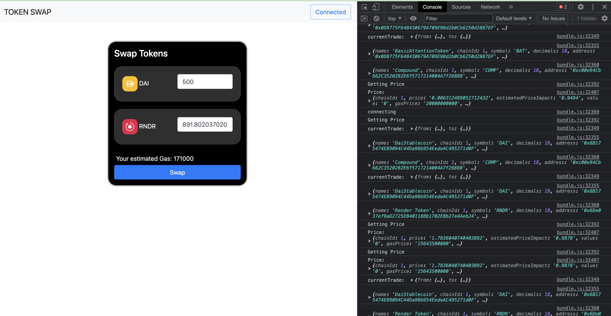
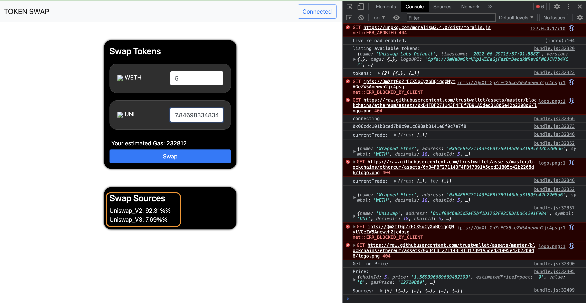

Remember to bundle everytime you touch the js file!

```zsh
browserify index.js --standalone bundle -o bundle.js
```


# Challenges

 - [x] Show the percentage breakdown where a swap was sourced from using the sourcesresponse param (ex: the best price comes from 50% Uniswap, 50% Kyber)
 - [x] Currently we setthe token allowance is set to the max amount. Change this to be safer so the user only approves just the amount needed.
 - [] Calculate price when a user enters new “to” token (right now it only auto-calculates when a user enters a new "from" token)
 - [] Show estimated gas in $
 - [] Filter down the long tokens list
 - [] Allows users to switch chains and receive a proper quote (remember the tokenlist will change as well!)


## Challenge 1

Change the `getPrice` function to populate the frontend with percentage of proportion.

Also swap to Goerli testnet for 0x API

```javascript
async function getPrice(){
    console.log("Getting Price");

    if (!currentTrade.from || !currentTrade.to || !document.getElementById("from_amount").value) return;
    let amount = Number(document.getElementById("from_amount").value * 10 ** currentTrade.from.decimals);

    const params = {
        sellToken: currentTrade.from.address,
        buyToken: currentTrade.to.address,
        sellAmount: amount,
    }

    // Fetch the swap price.Goerli
    const response = await fetch(`https://goerli.api.0x.org/swap/v1/price?${qs.stringify(params)}`);

    swapPriceJSON = await response.json();
    console.log("Price: ", swapPriceJSON);

    // [Challenge #1]
    // Get the source proportion and show in percent
    console.log("Sources: ", swapPriceJSON.sources)
    let parent = document.getElementById("source_list");
    // loop through source and see if any are greater than 0
    let source_list = swapPriceJSON.sources;

    for (source in source_list){
        if (Number(source_list[source].proportion) > 0){
            // Source row in the source list
            let div = document.createElement("div");
            // div.className = "source_list";
            let num = source_list[source].proportion;
            let perc = Number(num).toLocaleString(undefined,{style: 'percent', minimumFractionDigits:2})
            let html = `<span>${source_list[source].name}: ${perc}</span>`;
            div.innerHTML = html;
            parent.appendChild(div);
        };
    };
    document.getElementById("to_amount").value = swapPriceJSON.buyAmount / (10 ** currentTrade.to.decimals);
    document.getElementById("gas_estimate").innerHTML = swapPriceJSON.estimatedGas;
}
````




## Challenge 2

Set trySwap() to have only the amount the user is requesting

```javascript
    // Change for max approval [Challenge #2]
    // Get number of token in the from_amount element
    const maxApproval = Number(document.getElementById("from_amount").value);

````


